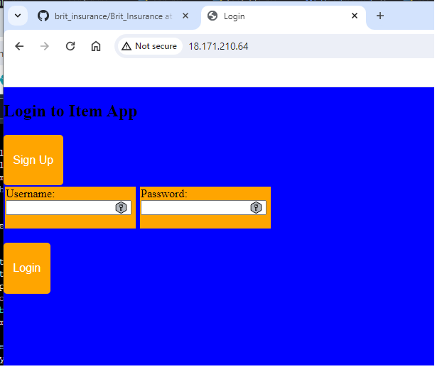

# Install the following dependencies to build the code locally

1. pip install fastapi
2. pip install uvicorn
3. pip install python-multipart sqlalchemy jinja2

# Steps to Run the application

1. Log in
2. python app.py
2. Load URL using AWS EC2's public IP Address, http://18.171.210.64, to access login screen
3. This will route the web request to EC2's public IP Address , which is forward via nginx config file to the
   application running locally on the EC2 box, at port 8800
4. The Host IP Address, Port & DB URL are decoupled away from the code, and are configurable via config.ini file in the
   config directory.
4. While accessing application first time, please go to Sign Up to add user and then use the credentials added to access
   the App.
5. Concept of Sessions has been added ito the application to ensure we can group together existing session's entries and
   sum them up together.
6. The application was also tested with concurrent users accessing the application and both users were only provided the
   sum of either own respective item entries ( utilizingthe session tokens)

# Screenshot of the application running on AWS EC2

# Github URL

Code for the application is uploaded on Github.
https://github.com/suneeshjoshi/brit_insurance/tree/main/Brit_Insurance

# Future Improvements:

1. Can use Load Balancer to front the EC2 deployments, & utilize Amazon Scaling Groups to dynamically add EC2 instances
   when required(depending on policies).
2. It will utilize the Launch Templates to ensure each EC2 instance spun up is identical
3. OAuth2 can be utilized to provide further improvements to the authentication mechanism.
4. SQL interactions are done via SQLAlchemy to provide database agnostic approach and out of the box ORM.
5. Underlying DB technologies can be changed without needing much change to the application.
6. DB can also benefit by adding Read Replicas(if the application encounters increased read load) or load balancers and
   more instances of DB servers which can provider higher throughput to DB requests.
